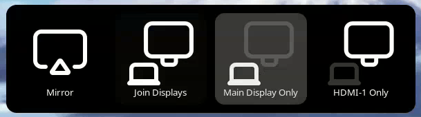

# Simple Display Switcher GNOME Extension

A GNOME extension that adds "Display xyz Only" options to the existing display switcher functionality (Super+P).

<p align="center">
  
</p>

## Dependencies

- GNOME Shell - [switchMonitor.js](https://gitlab.gnome.org/GNOME/gnome-shell/-/blob/main/js/ui/switchMonitor.js)

## Settings

You can change the following settings in the "Extensions" app or "Extension Manager":

- **Skip Confirmation Dialog:** When enabled, display changes will be applied immediately when you select an option from the menu, skipping the confirmation dialog.
- **Use Main Display Label:** When enabled, the first display will be labeled as "Main Display Only" instead of "Display 1 Only".
- **Use Display Names:** When enabled, the display names will be used instead of generic labels.

## Installation

### Manual Installation

1. **Create the extension directory structure:**
   ```bash
   mkdir -p ~/.local/share/gnome-shell/extensions/simple-display-switcher@dollique.com/schemas
   ```

2. **Copy the extension files to the directory:**
   ```bash
   # From your development folder
   cp metadata.json extension.js prefs.js stylesheet.css ~/.local/share/gnome-shell/extensions/simple-display-switcher@dollique.com/
   cp schemas/org.gnome.shell.extensions.simple-display-switcher.gschema.xml ~/.local/share/gnome-shell/extensions/simple-display-switcher@dollique.com/schemas/
   ```

3. **Compile the Settings Schema (Required):**
   This step is mandatory for the extension to read your preferences.
   ```bash
   glib-compile-schemas ~/.local/share/gnome-shell/extensions/simple-display-switcher@dollique.com/schemas/
   ```

## Testing and Deployment

### Restart GNOME Shell

1. **Restart the Shell:**
   - **On X11:** Press `Alt+F2`, type `r`, and press Enter.
   - **On Wayland:** You must Log Out or kill the session using `pkill -3 gnome-shell` (which also logs you out).

2. **Enable the extension:**
   ```bash
   gnome-extensions enable simple-display-switcher@dollique.com
   ```

## Troubleshooting

### Settings/Preferences Errors

If the extension fails to load or settings won't open, verify the schema is compiled:

```bash
ls ~/.local/share/gnome-shell/extensions/simple-display-switcher@dollique.com/schemas/gschemas.compiled
```
If this file is missing, repeat Step 3 of the installation.

### View Real-time Logs

To see debug output and DBus errors:

```bash
journalctl -f -o cat /usr/bin/gnome-shell
```
